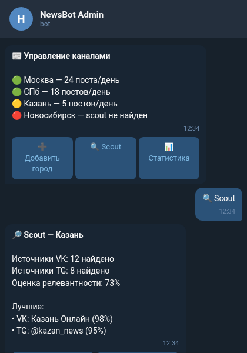

<div align="center">

# news

**Автоматизированные новостные Telegram-каналы для российских городов**


</div>

Система для создания и управления автоматизированными новостными Telegram-каналами для российских городов. Три компонента работают совместно: FastAPI-бэкенд (единый источник истины для базы данных), административный Telegram-бот и модуль-разведчик, который находит релевантные группы ВКонтакте и Telegram-каналы для каждого города с помощью оценки релевантности.

## ■ Возможности

- ❖ **Каналы по городам** — один автоматизированный новостной канал на город, источники из местных СМИ
- ❖ **Разведка ВКонтакте** — поиск релевантных групп ВКонтакте по городу через VK API с оценкой релевантности
- ❖ **Разведка Telegram** — поиск локальных Telegram-каналов через Telethon client API
- ❖ **Оценка релевантности** — оценка релевантности каждого найденного источника от 0 до 100
- ❖ **Административный бот** — Telegram-интерфейс для управления городами, источниками и статусом каналов
- ❖ **REST API** — FastAPI-бэкенд со Swagger UI, весь доступ к данным через HTTP
- ❖ **Загрузчик городов** — импорт российских городов из CSV (Росстат) и Wikipedia
- ❖ **Развёртывание в Docker** — docker-compose-конфигурация для сервисов бэкенда и бота

## ■ Стек

<div align="center">

| Компонент | Технология |
|-----------|------------|
| Бэкенд | FastAPI + uvicorn |
| Бот | aiogram 3.x |
| Разведчик | VK API, Telethon |
| База данных | SQLite (aiosqlite) |
| HTTP-клиент | aiohttp |
| Схемы | Pydantic (BaseModel) |
| Конфигурация | python-dotenv |
| Развёртывание | Docker Compose |

</div>

## ■ Как это работает

```
1. Модуль-разведчик запрашивает VK API и Telegram (через Telethon) для поиска локальных групп и каналов по городу, присваивая каждому оценку релевантности от 0 до 100.
2. Найденные источники регистрируются в FastAPI-бэкенде через HTTP и сохраняются в SQLite.
3. Административный Telegram-бот (aiogram) позволяет операторам добавлять города, просматривать источники и управлять статусом каналов — все запросы проходят через REST API.
4. Docker Compose объединяет сервисы бэкенда и бота для развёртывания.
```

## ■ Скриншоты

<div align="center">



*Основной интерфейс административного бота с управлением городами и источниками*

</div>

## ■ Использование

```bash
make install          # venv + зависимости
make api              # запустить бэкенд (порт 8000)
make run              # запустить бот (polling)
make cities           # загрузить российские города
make scout            # разведка ВКонтакте для всех городов
make scout CITY=Name  # разведка ВКонтакте для одного города
make tg-auth          # авторизация Telethon (интерактивная)
make tg-scout         # разведка Telegram
make clean            # удалить venv + базу данных

# Docker
docker compose build backend bot
docker compose up -d
```

## ■ Лицензия

MIT © [pluttan](https://github.com/pluttan)
